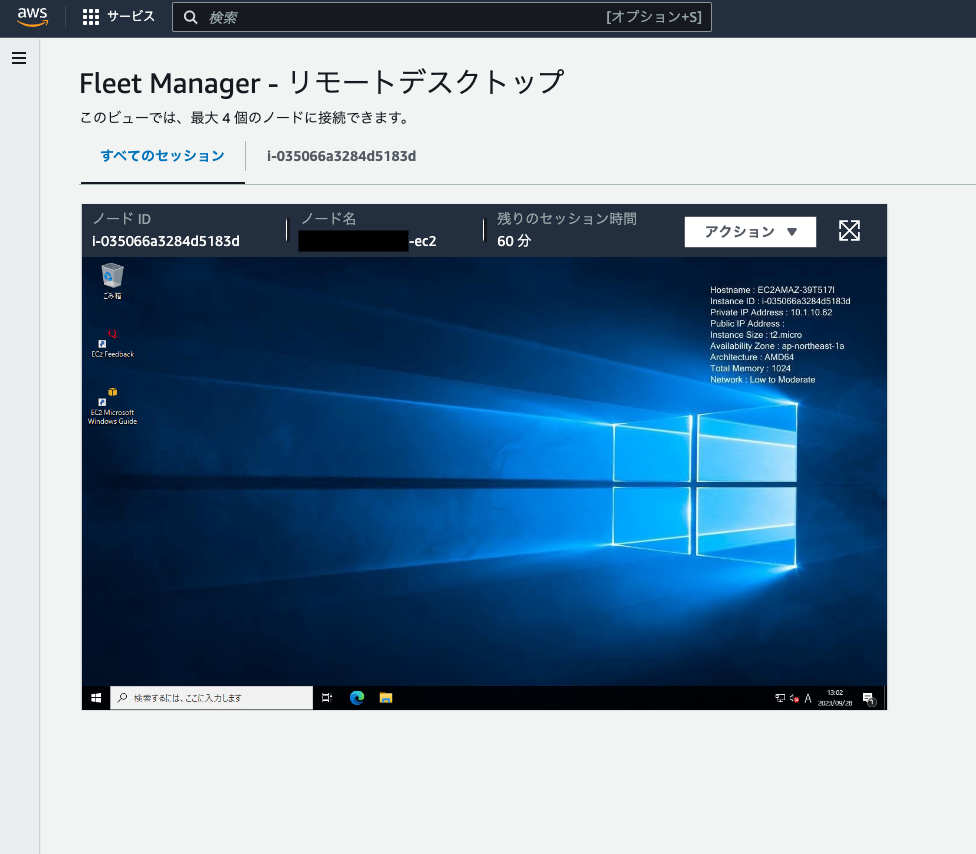

# AWS-EC2-RDS-sample
## 実行前の確認

- AWS CLI がインストールされている。`~/.aws/credentials`が作成されており、AWS アカウントが登録されている。作成されているフォルダは大抵以下。

```
/Users/~/.aws/credentials
```

config は以下のように記述（あくまで一例）。

```
[default]
region = ap-northeast-1

[fogefoge]
region = ap-northeast-1

```

credentials は以下のように記述（あくまで一例）。

```
[default]
aws_access_key_id = AKIA~~
aws_secret_access_key = ~~

[fogefoge]
aws_access_key_id = AKIA~~
aws_secret_access_key = ~~

```

## Step for Deploy AWS

このアプリケーションを AWS にデプロイする方法です。

### Terraform から AWS にデプロイ

Terraform から AWS にリソースを作成します。
`fogefoge` という AWS プロファイルから認証情報を読み取っています。
適宜変更してください。

```bash
cd terraform
terraform init
terraform apply
```

> [!Warning]
> AWS から消す・仕舞う・片付けることがしたい場合は
> 以下のコマンドを利用。
> `terraform destroy`

> [!Note]
> terrform のインフラ製作管理はコメントアウトで都度調整すること（踏み台サーバー等）

## システム構成図

T&M 様の要望通りの構成を準備


- サーバー 1 台の構成
- OS Windows
- DB は RDS を使用

## AWS コンソールでやるべきこと

プライベートサブネットにある EC2 インスタンス（Windows）をリモートデスクトップ接続（RDP）

> [!Note]
> Fleet Maneger という 443 ポートと 3389 ポートを開けなくても接続できる仕様がある。これを利用。

1. AWS コンソールで EC2 に入り、「接続」の「RDP クライアント」で「Fleet Manager を使用して接続する」を選択。「Fleet Maneger Remote Desktop」をクリックする。
   

2. 認証タイプでキーペアを選択。「ローカルマシンを参照して、キーペアファイルを選択します。」を選択し、参照ボタンを押す。Terraform 実行で作成される「./terraform/.key_pair」フォルダの「~.id_rsa」を選択する（秘密鍵なので取り扱い注意）。connect を押す。
   ※キーペアのコンテンツを貼り付けるでも対応可能。
   秘密鍵の権限操作が必要な場合、以下をターミナルまたはコマンドプロンプトで実行

   ```bash
   cd terraform/.key-pair
   chmod 600 fogefoge-key-pair.id_rsa
   ```

   

3. リモートデスクトップ接続が成功する。
   

## RDP 接続して、Windows で MySQL をインストールする

1. Microsoft Edge に入り、`https://dev.mysql.com/downloads/installer/`にアクセスする。
2. 任意のバージョンのインストーラーをインストール。
3. 必要なパッケージ群をインストール(Full 推奨)。
4. MySQL Workbench で動作確認。
   4-1. root ユーザーで確認。
   4-2. admin ユーザーかつ AWS RDS のエンドポイントで確認([./terraform/database/main.tf](terraform/database/main.tf)参照)

## 同一 keypair を用いて AWS EC2 の RDP 接続台数を 2 台に増やす

1. デスクトップ画面左下の「 Windows アイコン」を右クリック -> 「ファイル名を指定して実行」を選択。
2. 名前に「gpedit.msc」を入力 -> 「OK」を選択しローカルグループポリシーエディターを起動。
3. 左側のツリーを展開して以下の設定項目をダブルクリック。

```
[コンピューターの構成]
 -[管理テンプレート]
　- [Windows コンポーネント]
　　- [リモート デスクトップ サービス]
　　　- [リモート デスクトップ セッション ホスト]
　　　　- [接続]
　　　　　- [リモート デスクトップ サービス ユーザーに対してリモート デスクトップ サービス セッションを 1つに制限する]
```

4. 「無効」を選択。
5. 状態が無効になったことを確認。

> [!Warning]
> 3 台以上接続する場合、以下のような画面になるため注意。


## その他

- Amazon Inspector はコンソールで起動
- 認証について、Amazon Cognito を追加 (動作もある程度確認)
